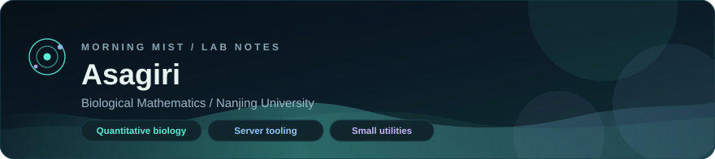
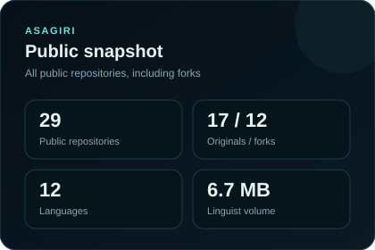
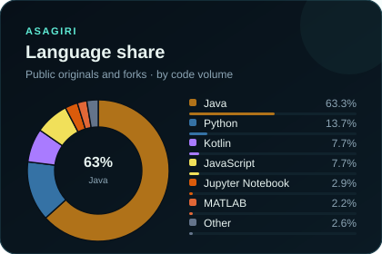

  

  
  
  

I build small, focused tools on two tracks: **quantitative biology** (structure, docking, research data) and **Minecraft server infrastructure** (proxies, economy, generation, AI helpers). The preference is a sharp utility over a sprawling monolith.

## Now

- Protein and data workflows that can run on Colab or a laptop
- Paper / Velocity / Fabric tooling for servers that need to stay operable
- Short scripts for migration, validation, and content generation

## Selected work

<table>
  <tr>
    <td width="50%" valign="top">
      <h3>Lab</h3>
      

        <a href="https://github.com/AsagiriBeta/ProtFlow"><strong>ProtFlow</strong></a> 
        Structure prediction, pocket detection, ligand docking, and BGC annotation.
      

      

        <a href="https://github.com/AsagiriBeta/TreeBarkAnalyzer"><strong>TreeBarkAnalyzer</strong></a> 
        Trunk contours, bark regions, texture features, and batch visualization.
      

      

        <a href="https://github.com/AsagiriBeta/Database-Downloader"><strong>Database-Downloader</strong></a> 
        Fetch and keep research databases in a repeatable local workflow.
      

    </td>
    <td width="50%" valign="top">
      <h3>World</h3>
      

        <a href="https://github.com/AsagiriBeta/Embedize"><strong>Embedize</strong></a> 
        Custom 3D terrain, biomes, and bundled vanilla structure generation.
      

      

        <a href="https://github.com/AsagiriBeta/Server-market"><strong>Server-market</strong></a> 
        Currency and market systems for Minecraft servers.
      

      

        <a href="https://github.com/AsagiriBeta/Velocity-LLM"><strong>Velocity-LLM</strong></a> 
        Proxy-side <code>@ai</code> assistant with RAG over local documents.
      

    </td>
  </tr>
</table>

## Analytics

All public repositories on this account, including forks. Cards are SVG files in this repo, refreshed weekly by GitHub Actions, so they do not depend on a third-party stats host.

  
  

  Language share uses GitHub Linguist byte volume. Workflow: <code>.github/workflows/profile-stats.yml</code>

